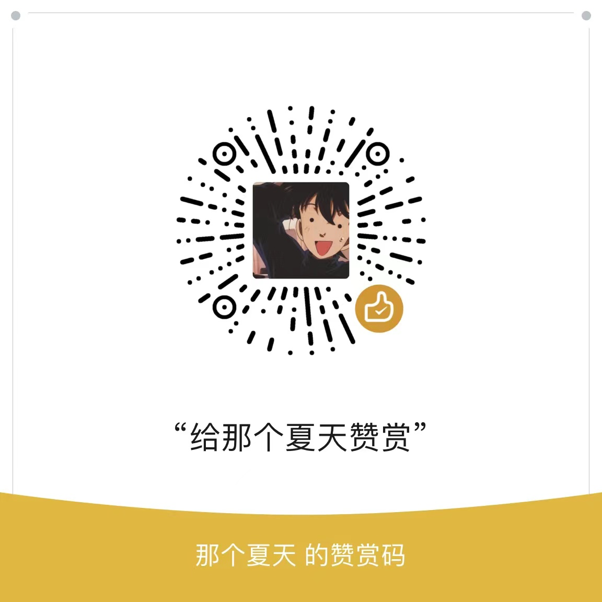

# wxgzh(微信公众号)
基于nodejs开发的微信公众号基础功能<br>
1、自定义关键字回复（文字、图片、语音、视频、音乐、图文等）<br>
2、自定义公众号菜单<br>
3、取关拉黑限制（回复关键字重置）<br>
4、邮件发送<br>
6、短信发送<br>
7、微信机器人基于wechaty开发 （自动同意好友、自动回复、自动拉群建群）正在开发中

### 1.项目构建

#### 1.将项目 clone 到本地
```
git clone git@github.com/Summer371/wxgzh
```
#### 2.加载模块
进入文件目录，输入 npm install -S 安装对应模块

#### 3.修改配置文件
进入文件目录，复制.env.example文件，复制改名为.env，修改配置文件（服务端口号，公众号配置等）

#### 4.启动服务器
进入目录文件，输入 npm run dev 启动服务

#### 5.映射外网地址
用natapp映射外网地址  natapp -authtoken=afxxxx0e3    

#### 6.配置微信
把映射的外网地址配置到微信公众号上


#### buy me a coffee
</img>


